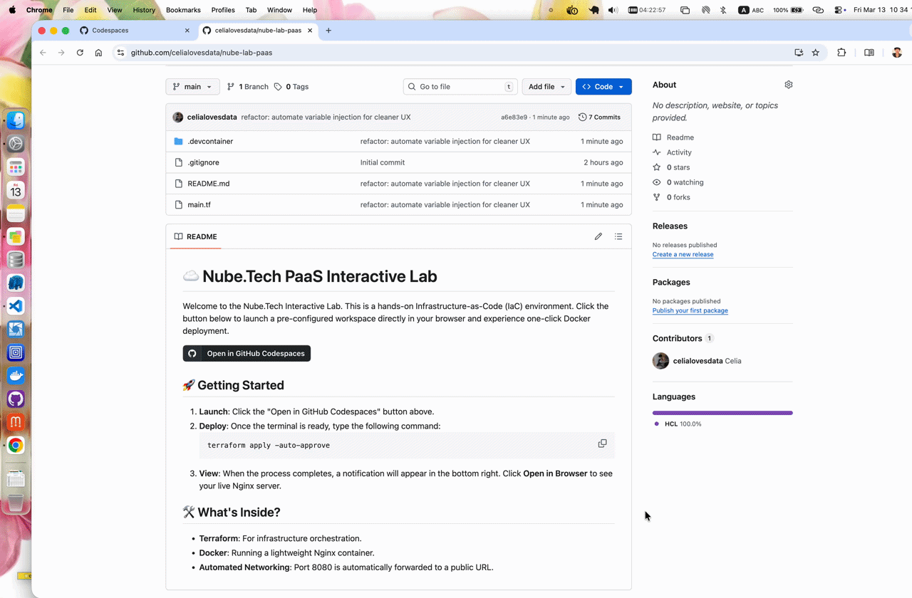

# 🚀 Projects Showcase

This page features my personal projects and open-source contributions, focusing on Infrastructure-as-Code (IaC), Automation, and Cloud-native solutions.

---

## ☸️ Google Kubernetes Engine GitOps Pipeline

An automated CI/CD implementation showcasing **GitOps principles** on Google Cloud Platform. This project demonstrates how to decouple application source code from environment configurations to ensure a secure, auditable, and scalable deployment workflow.

### 🔗 [View Repository](https://github.com/celialovesdata/hello-cloudbuild-app)

### 🛠️ Key Features
* **Decoupled Architecture**: Utilizes a two-repo strategy (App repo & Env repo) to prevent environment drift and maintain a clean audit trail.
* **Automated CI/CD**: Leverages **Google Cloud Build** for unit testing, containerization, and dynamic manifest rendering using `sed`.
* **GitOps Release Workflow**: Implements a **candidate/production branch strategy**, allowing for safe deployment attempts and instant rollbacks.
* **Cloud-Native Security**: Integrates **Secret Manager** for SSH deploy keys and **Artifact Registry** for immutable image versioning.

### 💻 Technical Stack

| Category | Technology |
| :--- | :--- |
| **Orchestration** | Google Kubernetes Engine (GKE) |
| **CI/CD Engine** | Google Cloud Build |
| **Registry** | Google Artifact Registry |
| **Secret Mgmt** | Google Secret Manager |

---

## ☁️ Nube.Tech PaaS Interactive Lab

An automated, browser-based sandbox environment that demonstrates the power of **Infrastructure as Code**. This project allows users to spin up a fully functional cloud development workspace with a single command.

### 📺 Watch the Demo

### 🛠️ Key Features
* **Zero-Config Environment**: Uses GitHub DevContainers to pre-configure a stable Ubuntu environment with Terraform and Docker pre-installed.
* **One-Click Deployment**: Automates the pull of Nginx images and container orchestration via a single `terraform apply`.
* **Dynamic Networking**: Automatically handles port forwarding and generates a public URL for the deployed service.
* **PaaS Simulation**: Provides a "PaaS-like" experience for backend infrastructure.

### 💻 Technical Stack

| Category | Technology |
| :--- | :--- |
| **Orchestration** | Terraform (HashiCorp) |
| **Containerization** | Docker (Docker-in-Docker) |
| **Environment** | GitHub Codespaces / DevContainers |
| **OS Support** | Ubuntu 22.04 LTS (Jammy) |

### 🔒 Access Note
> **Demo Restricted**: To maintain security and resource quotas, the source repository is currently set to **Private**.
>
> *Contact the owner for a live demonstration or architectural walkthrough.*

---

## 📂 Other Projects
*Coming soon...*

[Back to Home]({{ site.baseurl }}/)